# Clothing Image Classification Using Computer Vision 
While the MNIST dataset is often seen as the “hello world” into image 
recognition, it quickly runs into issues when attempting to use it for advanced machine 
learning due to the extremely high accuracy that can be reached with classifier tuning or 
using advanced neural network techniques. In response to this ceiling of usability, the 
Fashion-MNIST dataset was developed.

The Fashion-MNIST dataset was designed to serve as a direct drop-in 
replacement for the original MNIST dataset; it shares the same image size and structure 
of the training and testing splits from its predecessor. The training set of 60,000 
grayscale images with dimensions of 28x28 pixels is labeled into 10 different types of 
clothing and an additional testing set of 10,000.

## Obtaining The Data
There are many different options to acquiring the Fashion-MNIST dataset. 
Zalando, the company who developed the dataset, has the data hosted on Github to 
encourage ‘serious machine learning researchers’ to download and use it. Furthermore, 
the Fashion-MNIST dataset is hosted on many machine learning libraries like Kaggle, 
Pytorch, Keras, and Tensorflow. Because Tensorflow is one of the tools used to create 
evaluate the classifiers, the Fashion-MNIST dataset was imported from there.

## Exploratory Data Analysis
Taking a dive into summary statistics about the Fashion-MNIST dataset, there is 
not much benefit in quantitatively analyzing each attribute/pixel. However, some brief 
insights can be gleamed from the distribution of the labeling data; there are the same 
amount of each labeled clothing, resulting in 6000 of each in the training data and 1000 
of each in the testing data. This allows for proceeding with the classifier evaluation 
without worrying about imbalanced classification problems since most machine learning 
algorithms are designed for use on datasets with an equal distribution of classes.

## Models:
### Naive Bayes
Using the Naïve Bayes classifier did not provide great results. The classifier
accuracy could probably be increased by using Principal Component Analysis and 
reducing the dimension size but, given the complexity of the problem, it did not seem 
fruitful to pursue this classifier.
| Classifier | Test Accuracy | Training Time | Testing Time |
| -------- | ------- | ------- | ------- |
| Naïve Bayes | 58.56% | 0.58 sec | 0.39 sec | 

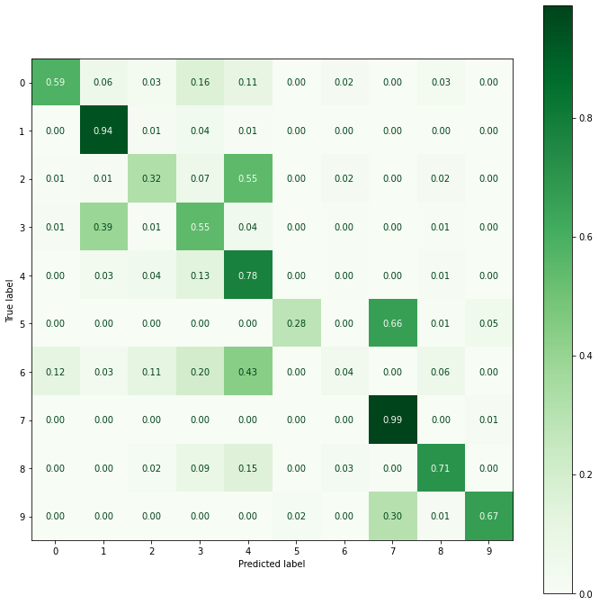

### k-Nearest Neighbors
kNN is an exception to the general workflow for building/testing supervised 
machine learning models since the model created from the kNN is all the available data 
placed in a metric space rather than split into train and test. Therefore, the training and 
testing times for this method are intertwined and inseparable.
| Classifier | Test Accuracy | Training/Testing Time |
| -------- | ------- | ------- |
| kNN | 89.86% | 5006 sec | 

### Random Forest
| Classifier | Test Accuracy | Training Time | Testing Time |
| -------- | ------- | ------- | ------- |
| Random Forest | 87.54% | 79.76 sec | 0.71 sec | 

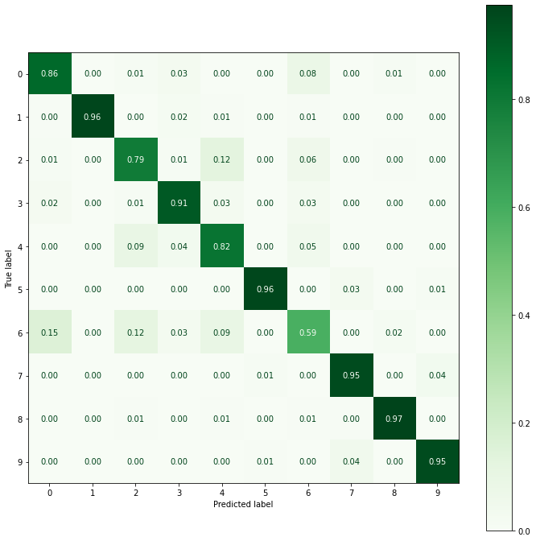

### Support Vector Machines
Since the number of samples in the Fashion-MNIST dataset is large, a linear 
support vector classification model was chosen due to potential scaling issues that 
could occur with the sequential minimal optimization procedure.
| Classifier | Test Accuracy | Training Time | Testing Time |
| -------- | ------- | ------- | ------- |
| SVM | 83.99% | 250.63 sec | 0.06 sec | 

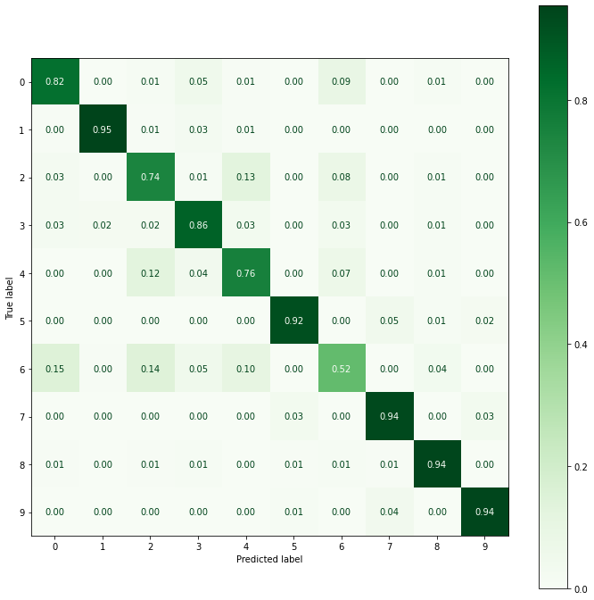

### Multilayer Perceptron
A multilayer perceptron with 100 hidden layers, learning rate of 0.01, and using 
the ‘adam’ weight optimization solver was run for 100 iterations to produce the following 
model for the Fashion-MNIST data.
| Classifier | Test Accuracy | Training Time | Testing Time |
| -------- | ------- | ------- | ------- |
| Multilayer Perceptron | 87.24% | 385.31 sec | 3.56 sec | 

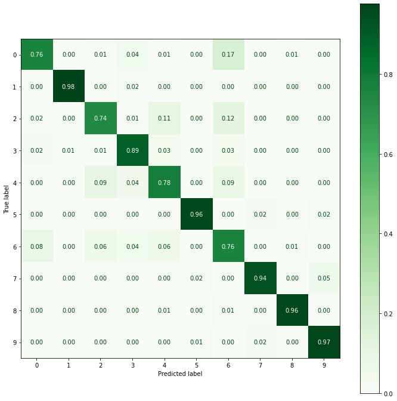

### Keras Baseline
A basic shallow neural network was created using Tensorflow and the Keras API. 
Due to noticeable overfitting in the baseline model, a dropout layer was added but it did 
not improve accuracy and also increased the required computational power.
| Classifier | Test Accuracy | Training Time | Testing Time |
| -------- | ------- | ------- | ------- |
| Keras Baseline | 89.62% | 68.05 sec | 0.62 sec | 
| Keras Baseline w/ Dropout | 89.62% | 84.35 sec | 0.69 sec | 

#### Keras Baseline Architecture and Training/Validation Accuracy
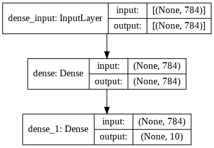
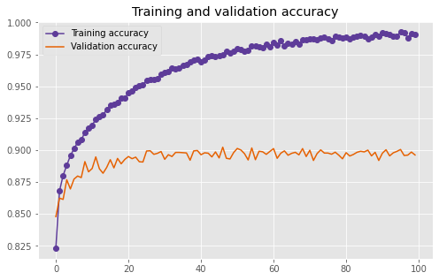

#### After Dropout Layer Architecture and Training/Validation Accuracy
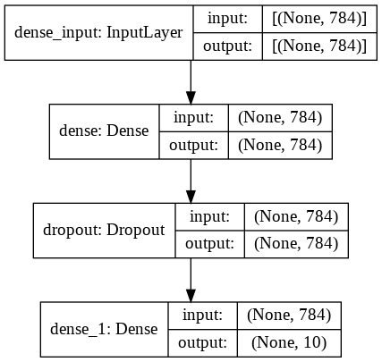
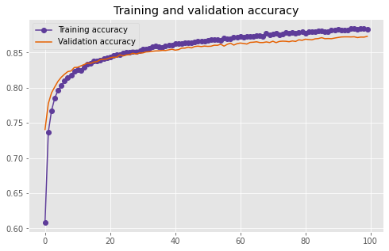

### Convolutional Neural Network
A convolutional neural network was created in Tensorflow with the Keras API by
adding two pairs of convolution and pooling layers to the base model with dropout. 
Although the structure is relatively simple, this architecture proved to be consistently 
efficient at modelling the Fashion-MNIST data and scored highly on the test set.
| Classifier | Test Accuracy | Training Time | Testing Time |
| -------- | ------- | ------- | ------- |
| Convolutional Neural Network | 91.16% | 110.23 sec | 0.76 sec | 

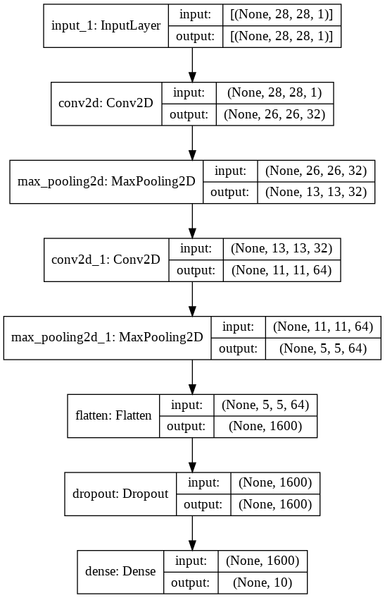
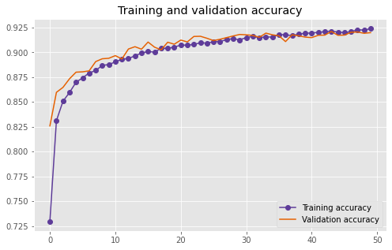

### LeNet-5 Imitation
Yann LeCun, the founding father of convolutional nets, proposed the original 
form of LeNet in 1989 and worked for several years in improving the model to the 
LeNet-5 iteration. While this model still provides significant accuracy over most 
traditional classifiers and multilayer perceptron, improvements in the pooling algorithms 
and kernel size tuning seem to have provided more performance in current 
convolutional neural networks.
| Classifier | Test Accuracy | Training Time | Testing Time |
| -------- | ------- | ------- | ------- |
| LeNet-5 Imitation | 88.62% | 82.01 sec | 0.63 sec | 
| LeNet-5 Imitation w/ Dropout | 90.32% | 111.17 sec | 0.58 sec | 

#### LeNet-5 Imitation Architecture and Training/Validation Accuracy
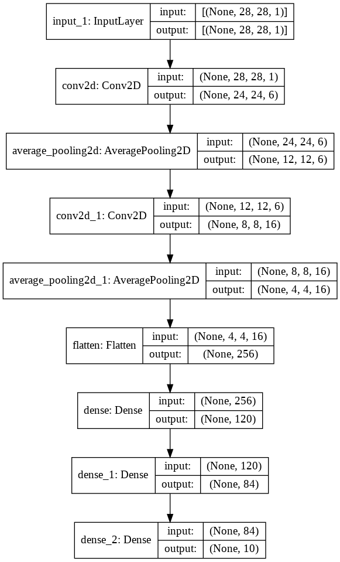
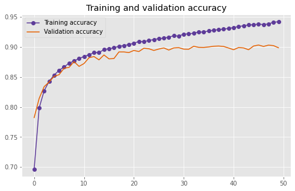

#### After Dropout Layer Architecture and Training/Validation Accuracy
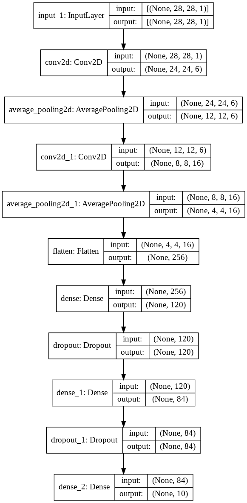
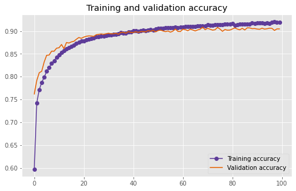

### 19-Layer CNN
With significant improvements to computational power thanks to Moore’s Law 
and GPU processing advancements, extremely deep neural networks can be trained 
within a reasonable timeframe. Leaning on these technological improvements, many 
additional hidden and classification layers were added to the architecture to improve the 
accuracy of the model. The final result was a 32% decrease in inaccuracy compared to 
the next best model.
| Classifier | Test Accuracy | Training Time | Testing Time |
| -------- | ------- | ------- | ------- |
| 19-Layer CNN | 93.95% | 369.68 sec | 0.95 sec | 

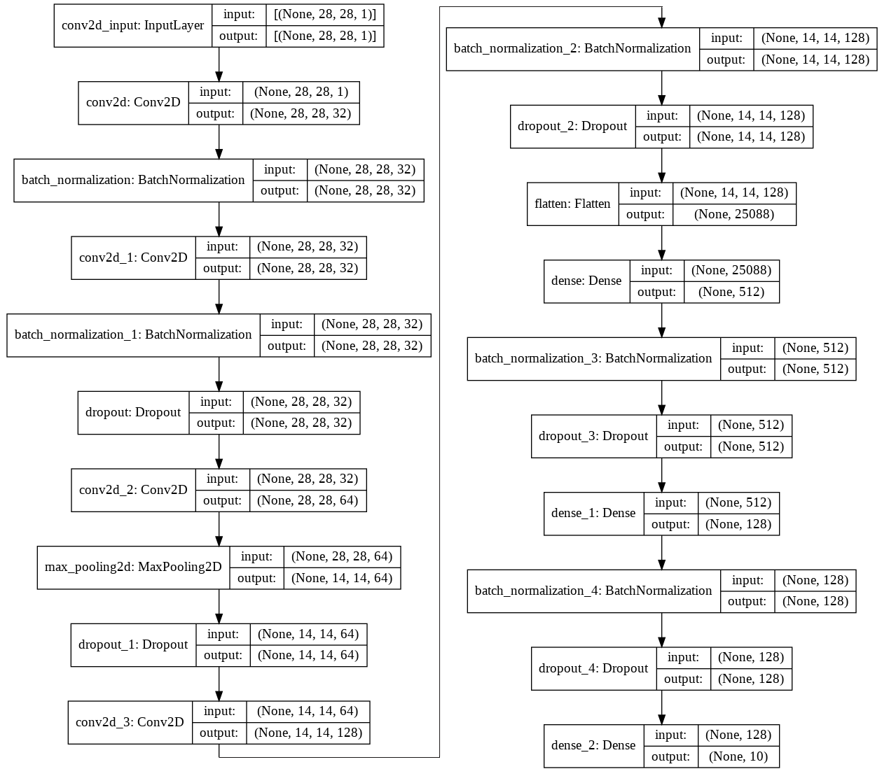
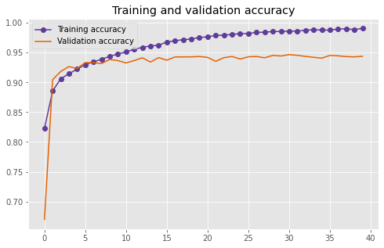

## Analysis
### Results from Each Classifier on Fashion-MNIST Test Set
| Classifier | Test Accuracy | Training Time | Testing Time |
| -------- | ------- | ------- | ------- |
| 19-Layer CNN | 93.95% | 369.68 sec | 0.95 sec |
| Convolutional Neural Network | 91.16% | 110.23 sec | 0.76 sec | 
| LeNet-5 Imitation w/ Dropout | 90.32% | 111.17 sec | 0.58 sec | 
| Keras Baseline | 89.62% | 68.05 sec | 0.62 sec | 
| Keras Baseline w/ Dropout | 89.62% | 84.35 sec | 0.69 sec | 
| LeNet-5 Imitation | 88.62% | 82.01 sec | 0.63 sec | 
| Random Forest | 87.54% | 79.76 sec | 0.71 sec |
| Multilayer Perceptron | 87.24% | 385.31 sec | 3.56 sec |
| SVM | 83.99% | 250.63 sec | 0.06 sec |  
| Naïve Bayes | 58.56% | 0.58 sec | 0.39 sec | 

Based on these results, different models will be better tuned for different tasks. If 
the primary concern is accuracy without regard for training time, then using the 19-Layer 
CNN would provide the most correct predictions for labeling the Fashion-MNIST test 
dataset. However, if there were limitations on computational power or training time then 
using a convolutional neural network with two pairs of convolution/pooling layers would 
provide decent results while significantly reducing the compute power required.
Furthermore, if a GPU is not available then I would not recommend using any neural 
network models due to extremely long training times; in that case, Random Forest 
would be my suggestion for an unimpressive but feasible model.

Among these results, there were several notable unfavorable outlier models in 
the data. For example, the Naïve Bayes model only scored a 58.56% accuracy, much 
worse than any other classification method. The kNN model, while providing 
commendable accuracy, seems unrealistic to use because of its intertwined training and 
testing time being prohibitively expensive. Finally, the multilayer perceptron proved itself 
to be the weakest neural network classification type that was tested, both requiring a 
large amount of training time while providing accuracy that could be comparable to a 
traditional classifier; this demonstrates why many applications for computer vision have 
moved from using MLP to CNN.

## Personal Conclusions
Comparing the accuracy of these classifiers on MNIST to Fashion-MNIST, it can 
be clearly seen that the Fashion-MNIST dataset provides much more challenging 
classification problem than its predecessor. By being a more difficult problem to solve, 
Fashion-MNIST highlights both the benefits and shortcomings from these different 
classifiers and provides better insights on how these algorithms might perform in more 
complex computer vision problems.

While traditional classification methods like Naïve Bayes, kNN, SVM, and 
random forest still prove to be relatively effective for sorting between the fashion labels, 
new neural network techniques (especially convolutional neural networks) use methods 
for feature detection that cannot be emulated by the other kinds of machine learning, 
regardless of the amount of tuning done to the classifier. However, the cost of this 
accuracy improvement is the computational intensity; these neural networks would take 
prohibitively long to run without using GPUs.

To further improve the accuracy of the classification, more tuning could be done 
on the 19-Layer CNN such as tuning the dropout layers (since there appears to be 
overfitting when comparing the training and validation data). Additionally, comparing the 
performance of each algorithm between multiple datasets like MNIST, CIFAR-10, or 
SVHN may provide insights on how robustly the classifier can perform under different 
computer vision problems.
